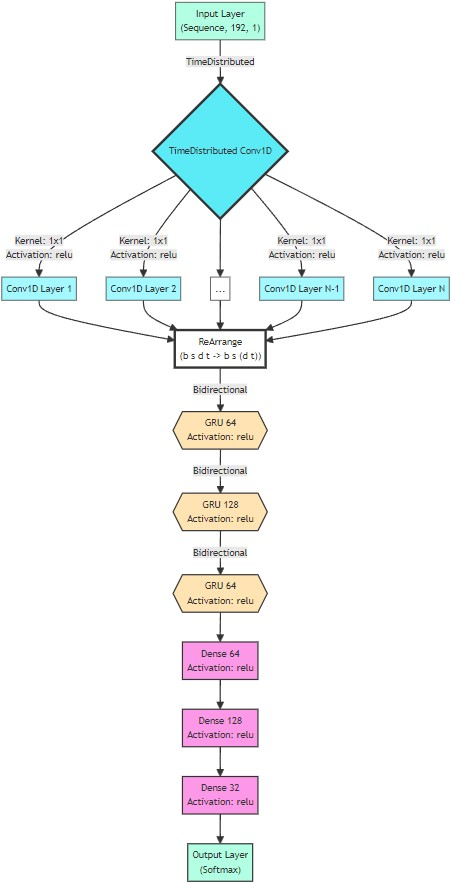

# Getso Command

Harness the power of gesture with Getso Command – your gateway to intuitive and responsive pose command recognition. Transforming human movement into a digital interface, Getso Command bridges the physical and virtual realms with unparalleled ease and precision.

## Table of Contents
- [Introduction](#introduction)
- [Architecture and Key Features Technology](#architecture-and-key-features-technology)
- [Installation](#installation)
- [Usage](#usage)
- [Demo](#demo)
- [Explore Our Kernel 🚀](#explore-our-kernel-)
- [Technology Stack](#technology-stack)
- [License](#license)
- [Contributing](#contributing)
- [Credits and Acknowledgements](#credits-and-acknowledgements)
- [Contact Information](#contact-information)

## Introduction
Getso Command is a cutting-edge pose command recognition system leveraging advanced computer vision and machine learning. By extracting key body points, it creates a dynamic, interactive user experience, pushing the boundaries of human-computer interaction.

## Architecture and Key Features Technology

### 1. Frame Capture Optimization
- **Efficient Threading**: Uses threading and queue system for high-performance frame capturing.
- **Flexibility with Input**: Supports direct processing of video files through file address input.
- **Enhanced Real-time Processing**: Optimizes real-time video frame handling for smoother performance.

### 2. Person Detection with YOLOv8
- **Rapid and Accurate**: YOLOv8 is known for its speed and precision in detecting persons.
- **High-Resolution Capability**: Excellently handles high-resolution inputs for detailed detection.
- **Simultaneous Detections**: Capable of detecting multiple people in a single frame.

### 3. Pose Detection with MediaPipe ([LearnOpenCV Analysis](https://learnopencv.com/yolov7-pose-vs-mediapipe-in-human-pose-estimation/))
Getso Command employs MediaPipe for its pose estimation capabilities due to several advantages over other technologies like YOLOv7:

- **Superior on Low-Res Inputs**: Outperforms YOLO in low-resolution settings.
- **CPU-Optimized Performance**: Faster performance on CPU, ideal for non-GPU devices.
- **Distant Object Detection**: Effective in detecting distant persons.
- **Single-Person Focus**: Specialized in single-person detection, aligning with application goals.
- **Reduced Computational Load**: Lower resource requirement compared to YOLOv.

### 4. Neural Network Architecture
- **Advanced Pose Recognition**: Employs a sophisticated neural network for interpreting gesture sequences.
- **Feature Extraction**: Uses 1D Convolution and Time Distributed layers for effective feature analysis.
- **Temporal Analysis**: Incorporates Bidirectional GRUs for capturing dynamics over time.
- **Gesture Classification**: Ends with a softmax layer for precise gesture categorization.



### 5. Continuous Gesture Recognition
- **Dynamic Keypoint Updating**: To maintain an ongoing recognition process, the model processes sequences of 30 keypoints obtained from 30 frames (representing 1 second) to predict gestures accurately.
- **Real-Time Responsiveness**: The application ensures real-time responsiveness by dynamically updating the keypoints sequence. With each new frame captured, the oldest keypoint in the sequence is removed, and the newest keypoint is appended. This method guarantees that the model always analyzes the most current data, ensuring fluid and continuous gesture recognition.
- **Balanced Processing**: Efficiently manages the addition of new data and removal of older data, maintaining a balance that is crucial for continuous and accurate gesture interpretation.
- **Versatile Command Set**: Recognizes commands such as 'Hello', 'Alarm', and 'Play Music', with all other gestures marked as 'Unknown'.


## Installation
Follow these steps to set up Getso Command on your system:

1. **Download the Pretrained Model Weights**:
   - First, download the [pretrained model weight](https://drive.google.com/file/d/1ZrOyA84jIop2Z1WJGwOauCKoBzELfOgu/view?usp=sharing).
   - Place the downloaded file into the ***models*** directory within your Getso Command project folder. Note that due to Github limitations, you will need to create the ***models directory*** yourself.

2. **Install Required Libraries**:
   - Open your terminal or command prompt.
   - Navigate to the root directory of the Getso Command project.
   - Run the following commands to install necessary libraries:

```bash
pip install torch torchvision torchaudio --index-url https://download.pytorch.org/whl/cu117
pip install -r requirements.txt
```

## Usage
Getso Command responds to the following gestures:

- **Hello**: Initiate with a right-hand wave.
- **Alarm**: Activate by raising both hands.
- **Play Music**: Trigger by performing the predefined dance movements.

```bash
python run.py -f ./video.mp4 -r [192, 1, 1015, 747]
```

or

```bash
python run.py -f rtsp://username:password@ip:port
```

## Demo
Get a glimpse of Getso Command in action with our demo. This visual demonstration highlights the application's real-time gesture recognition capabilities. You can find it in ./assets directory.


# Explore Our Kernel 🚀
We are thrilled to unveil our cutting-edge kernel, an embodiment of innovation that integrates the audio manipulation capabilities of VoxArte Studio! It's not just a repository; it's a revolution in audio processing, built with our audio projects at its heart.

## Catch the Wave of Audio Innovation
Don't miss out on this opportunity to be a part of the audio evolution. Click the link blow, star the repo for future updates, and let your ears be the judge. If you're as passionate about audio as we are, we look forward to seeing you there!

Remember, the future of audio is not just heard; it's shared and shaped by enthusiasts and professionals alike. Let's make waves together with VoxArte Studio and our Kernel. 🚀

🔗 [Kernel Repository](https://github.com/Meta-Intelligence-Services)

---

For any queries or discussions regarding our kernel, feel free to open an issue in the kernel's repository, and we'll be more than happy to engage with you. Together, we're not just changing audio; we're making history!


## Technology Stack
Getso Command is built with the following robust technologies:

- OpenCV-Python
- PyTorch and its ecosystem
- Singleton-Decorator
- MediaPipe
- Einops
- TensorFlow

---

Make sure to install all required libraries using the requirements.txt file - which exists in each project's directory - or manually install them with pip if necessary.

## License
Getso Command is open-sourced under the MIT License. See [LICENSE](LICENSE) for more details.

## Contributing
While we deeply value community input and interest in Gesto Command, the project is currently in a phase where we're mapping out our next steps and are not accepting contributions just yet. We are incredibly grateful for your support and understanding. Please stay tuned for future updates when we'll be ready to welcome contributions with open arms.

## Credits and Acknowledgements
We would like to extend our heartfelt thanks to Mr.Hesam Davarpanah for his guidance and wisdom throughout the development of Gesto Command. His insights have been a beacon of inspiration for this project.

## Contact Information
Although we're not open to contributions at the moment, your feedback and support are always welcome. Please feel free to star the project or share your thoughts through the Issues tab on GitHub, and we promise to consider them carefully.please [open an issue](https://github.com/Amir-Nassimi/Getso-Command/issues) in the Getso Command repository, and we will assist you.